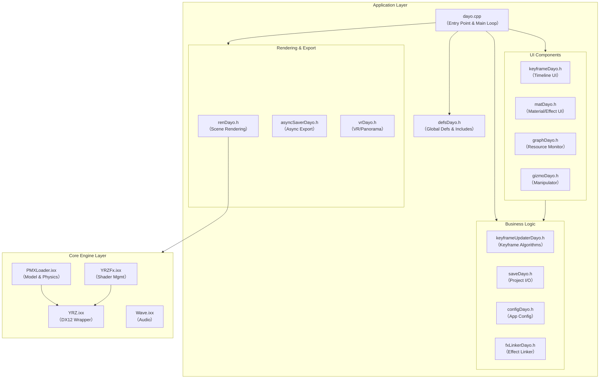

# MikuMikuDayo Architecture Document
## Part 1: Module Composition & Function Mapping

**Version**: 1.1  
**Last Updated**: 2026-01  
**Target**: Developer & Maintainer  

---

## 1. Overview
MikuMikuDayoは、DirectX 12を基盤とした3Dキャラクターアニメーション作成ツールである。
アーキテクチャは大きく分けて、汎用的な描画・演算機能を提供する **Core Engine Layer** と、アプリケーション固有のロジックやUIを実装する **Application Layer** の2層構造となっている。

### 1.1 Module Dependency Graph

---

## 2. Core Engine Layer Modules
MikuMikuDayoの基盤となる、アプリケーション非依存（または疎結合）なモジュール群。これらはC++20 Modules (`.ixx`) として実装されている。

| Module Name | Source File | Description & Responsibilities | Key Classes / Functions |
| :--- | :--- | :--- | :--- |
| **YRZ Core** | `YRZ.ixx` | **DirectX 12 Low-Level Wrapper** DX12デバイスの初期化、コマンドリスト管理、スワップチェーン制御、ウィンドウ管理など、描画の土台を提供する。 | `class DXR` `class DescriptorHeap` `class Texture` |
| **YRZ FX** | `YRZFx.ixx` | **Shader & Effect Management** HLSLシェーダの読み込み・解析、DXSAS互換のアノテーション解析、PSO (Pipeline State Object) の構築を行う。 | `class FX` `class Pass` `class FXWatcher` |
| **PMX Core** | `PMXLoader.ixx` | **Model & Physics Engine** PMX形式の3Dモデルデータのパース、保持。Bullet Physicsライブラリを用いた剛体・物理演算の実行。 | `struct Model` `struct Bone`, `Morph` `class BulletPhysics` |
| **Audio** | `Wave.ixx` | **Audio Processing** WAVファイルの読み込み、再生、波形データの解析（タイムライン表示用）。 | `class Wave` `GetPCMData()` |

---

## 3. Application Layer Modules
Core Engineを利用して構築された、MikuMikuDayo本体の機能群。主にヘッダオンリーライブラリ (`.h`) として実装され、`dayo.cpp` で統合される。

### 3.1 Main & Global
| Module Name | Source File | Description & Responsibilities |
| :--- | :--- | :--- |
| **Entry Point** | `dayo.cpp` | **Application Root** WinMain関数、メインループの実装。ImGuiの初期化・フレーム開始、イベントハンドリング、各モジュールの呼び出し統括を行う。 |
| **Global Defs** | `defsDayo.h` | **Global Definitions** 全モジュールで共通して使われる定数、マクロ、構造体、外部ライブラリのインクルード定義。キーバインド定義も含む。 |

### 3.2 UI & Editor Logic
ユーザーインターフェースと、それに直結する編集機能。

| Module Name | Source File | Description & Responsibilities |
| :--- | :--- | :--- |
| **Timeline UI** | `keyframeDayo.h` | **Keyframe Editor Window** タイムラインの描画、キーフレームの選択・移動・削除UI。波形表示。`KeysVariant`を用いた多態的なデータアクセスUIを提供する。 |
| **Material UI** | `matDayo.h` | **Material & Effect Window** モデルの材質ごとのシェーダ割り当て、エフェクトパラメータ（float, texture等）の調整UI。 |
| **Manipulator** | `gizmoDayo.h` | **3D Gizmo** ビューポート上でボーンやカメラを直接操作するための平行移動・回転マニピュレータの表示と入力処理。 |
| **Resource Monitor** | `graphDayo.h` | **System Metrics** VRAMおよびシステムRAMの使用量を監視し、円グラフ等で可視化するデバッグ・パフォーマンスモニタ。 |

### 3.3 Business Logic & Data Management
UIから分離された、データの加工や保存に関するロジック。

| Module Name | Source File | Description & Responsibilities |
| :--- | :--- | :--- |
| **Keyframe Logic** | `keyframeUpdaterDayo.h` | **Keyframe Algorithms** キーフレームの補正（位置・回転のスケール/オフセット）、反転ペースト、Undo/Redo用データの生成ロジック。 |
| **Project I/O** | `saveDayo.h` | **Serialization** `.dayo` 形式（JSONヘッダ + バイナリボディ）でのプロジェクト保存・読み込み処理。`cereal`ライブラリを使用。 |
| **Effect Linker** | `fxLinkerDayo.h` | **Effect Linking** 外部の`.fx`ファイルとPMXモデルを紐づける管理クラス。ラッパーファイル（`.fxdayo`）の生成と管理。 |
| **Configuration** | `configDayo.h` | **App Configuration** ウィンドウサイズ、言語設定、ミップマップ生成設定などのアプリケーション設定の永続化。 |

### 3.4 Rendering & Export
描画パイプラインと出力機能。

| Module Name | Source File | Description & Responsibilities |
| :--- | :--- | :--- |
| **Renderer** | `renDayo.h` | **Scene Rendering** 背景、モデル、アクセサリの描画パス構築。シャドウマップ生成。VR/パノラマ描画の制御。 |
| **Async Export** | `asyncSaverDayo.h` | **High-Performance Export** GPU Readbackヒープを用いた非同期のスクリーンショット保存。FFmpegパイプラインへのフレーム転送による動画出力。 |
| **VR Support** | `vrDayo.h` | **VR / Panorama** VRデバイス（OpenXR等想定）や180度パノラマ動画出力のためのビュー行列管理。 |

---

## 4. Functional Mapping Table
ユーザーから見た機能が、どのモジュール（ソースコード）によって実現されているかの対応表。

| User Function / Feature | Primary Module | Helper / Related Modules |
| :--- | :--- | :--- |
| **モデル読み込み** | `PMXLoader.ixx` | `dayo.cpp`, `matDayo.h` |
| **物理演算 (再生)** | `PMXLoader.ixx` | `dayo.cpp` (Update loop) |
| **タイムライン操作** | `keyframeDayo.h` | `defsDayo.h` (KeyBind) |
| **キーフレーム補正** | `keyframeUpdaterDayo.h` | `keyframeDayo.h` (UIトリガー) |
| **アンドゥ/リドゥ** | `dayo.cpp` | `keyframeUpdaterDayo.h`, `PMXLoader.ixx` |
| **エフェクト割当** | `matDayo.h` | `fxLinkerDayo.h`, `YRZFx.ixx` |
| **描画・プレビュー** | `renDayo.h` | `YRZ.ixx`, `YRZFx.ixx` |
| **画像/動画保存** | `asyncSaverDayo.h` | `dayo.cpp` |
| **プロジェクト保存** | `saveDayo.h` | `configDayo.h` |
| **メモリ監視** | `graphDayo.h` | `YRZ.ixx` |
