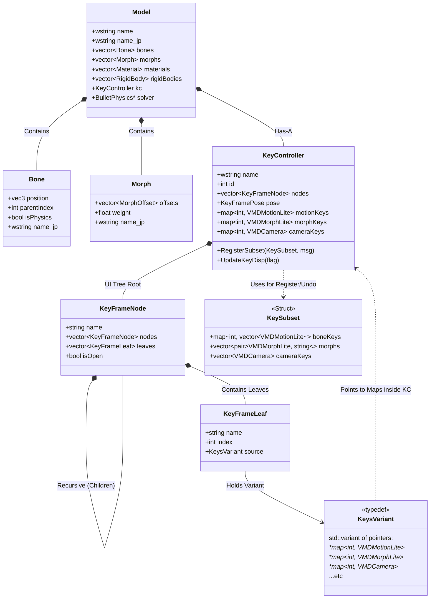

# MikuMikuDayo Architecture Document
## Part 2: Data Structures & Keyframe Management

**Target**: PMX Model Structure & Animation Data Flow

---

このパートでは、以下の3つの関係性を明確に可視化します。

・PMXデータ構造: モデル・ボーン・モーフの保持構造。

・キーフレームコンテナ: 時間軸データ（std::map）の持ち方。

・UIとのバインディング: ツリー構造（Node/Leaf）と KeysVariant を介したデータアクセス。

## 1. Data Structure Class Diagram
MikuMikuDayoでは、PMXモデルデータ(`Model`)と、そのアニメーション制御(`KeyController`)が密接に連携している。
特徴的なのは、UI表示用のツリー構造(`KeyFrameNode`)が、実データへのポインタ(`KeysVariant`)を保持することで、多態的なアクセスを実現している点である。

---

## 2. Data Components Detail

### 2.1 PMX Data Structure (`PMXLoader.ixx`)
モデルの形状と物理演算の定義。

| Class / Struct | Description |
| :--- | :--- |
| **`PMX::Model`** | キャラクター1体を表すルートオブジェクト。`dayo.cpp` 内の `vector<PMX::Model> models` で管理される。カメラも特殊なモデルとして扱われる場合がある。 |
| **`PMX::Bone`** | ボーン定義。親子関係、初期位置、物理設定フラグなどを持つ。 |
| **`PMX::Morph`** | モーフ定義。頂点移動量や材質変更データの集合。現在の適用量は `weight` で管理されるが、アニメーション再生時は `KeyController` によって上書きされる。 |

### 2.2 Keyframe Controller (`KeyController`)
アニメーションデータの管理と、UIへのインターフェースを提供するクラス。

| Member | Description |
| :--- | :--- |
| **`nodes` / `leaves`** | タイムラインウィンドウ左側に表示されるツリー構造。モデル読み込み時にボーン階層構造に基づいて構築される。 |
| **Data Maps** | `std::map<int, T>` 形式でキーフレームを保持。`int` はフレーム番号。キーが存在しないフレームは補間計算される。 |
| **`pose`** | 現在のフレームにおける計算済みの姿勢データ（キャッシュ）。描画スレッドはこの値を参照する。 |

### 2.3 The `KeysVariant` Mechanism
C++17 `std::variant` を使用し、異なる型のキーフレームマップへのアクセスを統一する仕組み。

1.  **UI Construction**: `KeyFrameLeaf` 作成時に、その葉が担当するデータマップ（例：`motionKeys` 内の特定ボーンのマップ）へのポインタを `source` に格納する。
2.  **Generic Access**: UI描画や編集ロジック（`keyframeUpdaterDayo.h`）では、`std::visit` を使用して `source` にアクセスする。
3.  **Type Safety**: これにより、「ボーン」「カメラ」「モーフ」といった異なるデータ型を、型安全かつ分岐ロジックなし（または最小限）で一元管理している。

### 2.4 Undo/Redo & Copy/Paste (`KeySubset`)
編集操作の単位となるデータ転送オブジェクト（DTO）。

* **役割**: 「ある瞬間に変更されたキーフレームの集合」を保持する。
* **Undo**: `RegisterSubset` 呼び出し時に、変更前の状態が差分として保存される。
* **Clipboard**: コピー操作時、選択されたキーフレームが `KeySubset` 形式でクリップボード（`g_copyBuffer`）にシリアライズされる。

---

## 3. Class Relationship Notes
* **UIとデータの分離**: `KeyFrameNode/Leaf` はデータのコピーを持たず、`KeysVariant` を通じて `KeyController` 内の実データを直接参照・操作する。
* **カメラの扱い**: カメラは `PMX::Model` 構造体の一部として実装されるか、あるいは共通の `KeyController` インターフェースを持つ特殊インスタンスとして扱われる（`IDX_CAMERA` 参照）。
