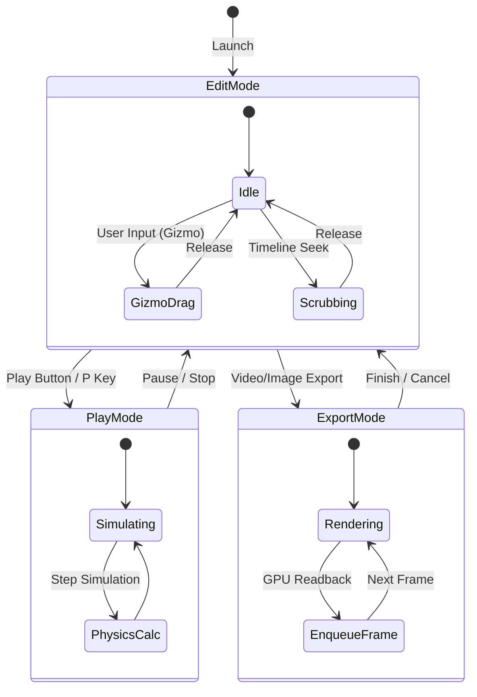
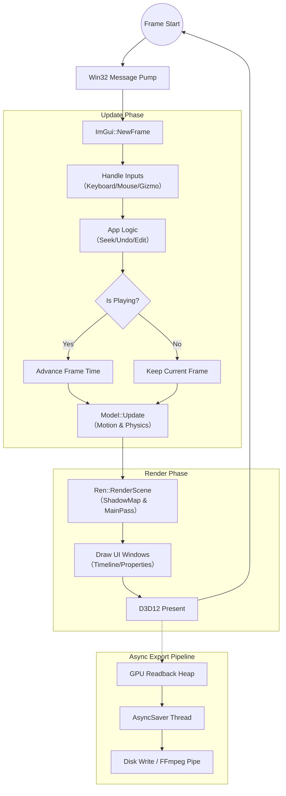
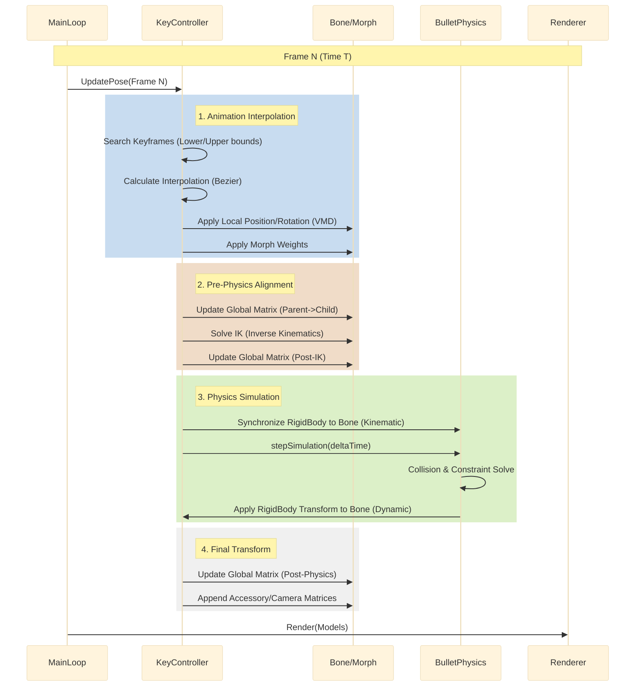

# MikuMikuDayo Architecture Document
## Part 3: State Transition & Execution Flow

**Target**: Application Lifecycle, Main Loop, and Update Pipeline

---
このパートでは、アプリケーションがどのように時間を管理し、入力を受け取り、毎フレームの描画へ至るかの「動的」な振る舞いを可視化します。特に、MMD互換ソフトとして重要な 「モーション更新と物理演算の順序」 や 「非同期保存の仕組み」 に焦点を当てています。

## 1. Application State Machine
MikuMikuDayoは、主に「編集(Edit)」「再生(Play)」「出力(Export)」の3つの主要な状態を持つ。
これらは `dayo.cpp` 内のフラグ（`Animation`や`Recording` 等）や `AsyncSaver` の状態によって管理される。

## 2. Main Loop Execution Flow (dayo.cpp)
Windowsメッセージ処理から描画までの1フレームの処理フロー。 ImGui のImmediate Mode GUIパラダイムに基づき、ロジック更新とUI構築が密接に関係している。

## 3. Detailed Model Update Pipeline
1フレーム内でのキャラクター姿勢計算の詳細順序。 MMD互換の挙動を実現するため、「VMD適用 → IK → 物理演算 → 物理適用」 の順序が厳密に定義されている。

## 4. Execution Components Description

### 4.1 Update Logic (`dayo.cpp`, `PMXLoader.ixx`)
* **Time Management**: `g_player` が再生時間を管理し、FPS（通常30または60）に基づいたデルタタイムを供給する。
* **Input Handling**: ImGuiの `IsItemActive()` や `IsMouseClicked()` を判定し、3Dビューポート上の操作（ギズモ操作）か、UI上の操作（スライダー操作）かを区別してイベントを発行する。
* **Physics Sync**:
    * **Kinematic (ボーン追従)**: アニメーションで動くボーンの位置を、剛体（RigidBody）に反映させる。
    * **Dynamic (物理演算)**: Bullet Physicsの計算結果を、ボーンの位置に書き戻す。

### 4.2 Rendering Pipeline (`renDayo.h`, `YRZFx.ixx`)
1.  **Shadow Pass**: 光源からの深度マップを生成（ShadowMap）。
2.  **Z-PrePass**: (Optional) 深度バッファのみを先行描画し、オーバードロードを軽減。
3.  **Main Pass**:
    * 背景 (Skybox/Grid)
    * モデル描画 (PMX): 材質ごとにマテリアル設定（`.fx` / `.fxdayo`）を切り替えて描画。
4.  **UI Pass**: ImGuiのドローリストをオーバーレイ描画。

### 4.3 Async Export System (`asyncSaverDayo.h`)
メインスレッド（UI/描画）を停止させずに高解像度出力を行う仕組み。

* **GPU Readback**: `ID3D12Resource` の `CopyTextureRegion` を使用し、レンダーターゲットの内容をReadbackヒープ（CPUから読めるメモリ）へ転送。
* **Worker Thread**: メインスレッドとは別のスレッド(`std::thread worker`)が待機。
* **Pipeline**:
    1.  Main Thread: `jobs` キューに読込タスクをPushし、GPUコマンドを発行。
    2.  Worker Thread: `cv_push` で起床し、GPU完了済みリソースからデータを読み出す。
    3.  Output: PNG保存、または `_popen` で開いたFFmpegパイプへ `fwrite` する。
